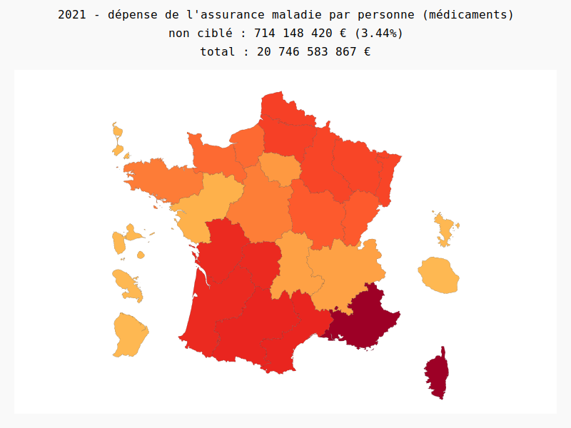
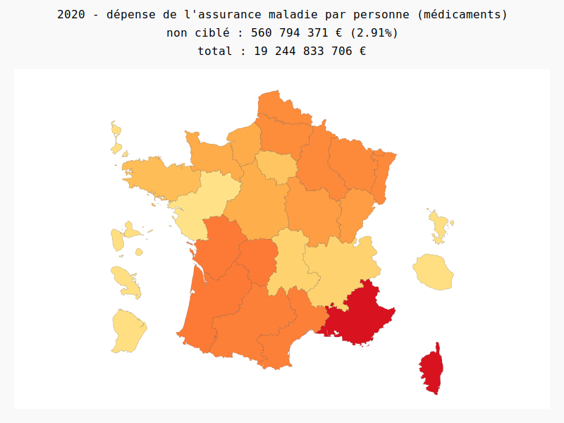
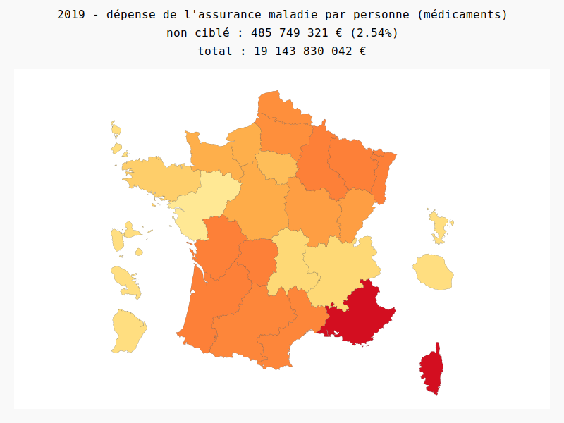
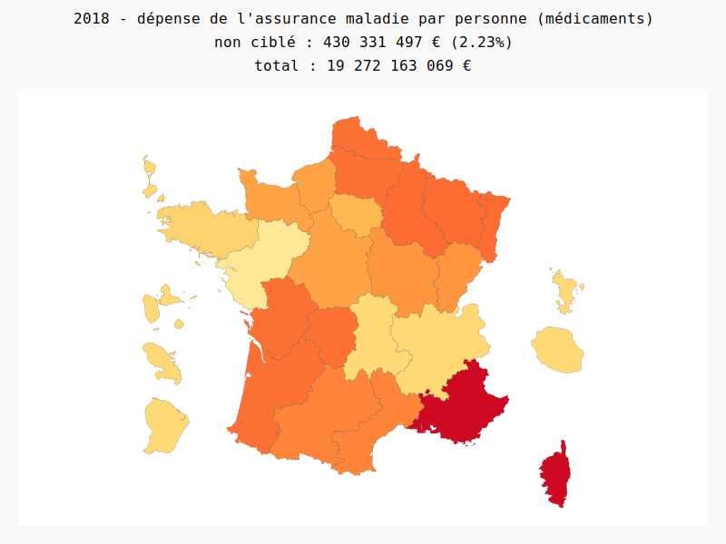
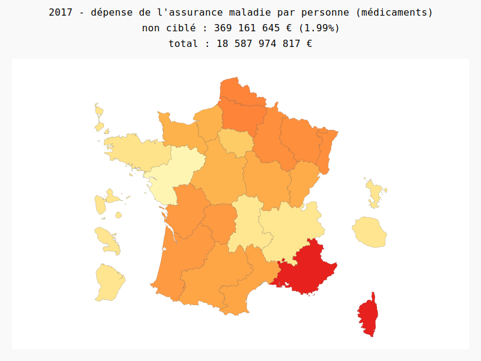

# data.fr.AssuranceMaladie

**raw data**  
Open Medic : base complète sur les dépenses de médicaments interrégimes  
Source : [assurance-maladie.ameli.fr : Open Medic](https://assurance-maladie.ameli.fr/etudes-et-donnees/open-medic-base-complete-depenses-medicaments-2021)  
Licence : Licence Ouverte / Open Licence  

Population de 1999 à 2022 (hardcoded in script)  
Source : [data.gouv.fr/fr/datasets/population](https://www.data.gouv.fr/fr/datasets/population/)  
Licence : Licence Ouverte / Open Licence  

## Analyse
Pour chaque (grande) région, on analyse les dépenses de médicaments (remboursement) de l'assurance maladie par personne.  
`valeur(region) = somme_remboursement(region) / population(region)`

## Avertissement biais

Une partie des dépenses est anonymisée ou non renseigné par l’assurance maladie, il est possible que ces dépenses concernent de manière inégale les différentes régions.

# Visualisation

<object data="2021.svg" type="image/svg+xml">  </object>
<object data="2020.svg" type="image/svg+xml">  </object>
<object data="2019.svg" type="image/svg+xml">  </object>
<object data="2018.svg" type="image/svg+xml">  </object>
<object data="2017.svg" type="image/svg+xml">  </object>

**legende**  

